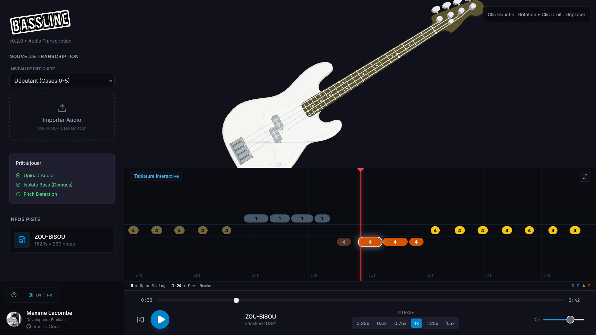

# Bassline
### *AI-Powered Bass Transcription & 3D Visualization*




## 📖 Project Overview
"Bassline transforms any audio file (MP3/WAV) into an interactive 3D bass lesson. It uses state-of-the-art Source Separation (Demucs) and Pitch Detection (Basic Pitch) to isolate the bass line and generate a tablature in real-time."

## ✨ Key Features
- **🤖 AI-Driven DSP:** Bass stem isolation using Meta's Demucs model.
- **🎸 Interactive 3D:** Real-time WebGL visualization (R3F) synced with AudioContext.
- **🎼 Smart Tablature:** Dynamic difficulty mapping (Beginner/Intermediate/Pro) using graph theory pathfinding.
- **🧠 Pipeline Explorer:** Interactive visualization of the backend architecture and data flow.
- **🌍 International:** Full i18n support (English/French).

## 🛠️ Tech Stack

### Frontend
- **Framework:** Next.js 14
- **3D Engine:** React Three Fiber (Three.js)
- **Styling:** Tailwind CSS
- **Animation:** Framer Motion
- **State Management:** Zustand

### Backend
- **Core:** Python, Flask
- **AI Models:** Demucs (Hybrid Transformer), Basic Pitch (CNN)
- **Infrastructure:** Redis (Task Queue)

## 🚀 Getting Started

### 1. Clone the Repository
```bash
git clone https://github.com/yourusername/bassline.git
cd bassline
```

### 2. Frontend Setup
```bash
# Install dependencies
npm install

# Run the development server
npm run dev
```

### 3. Backend Setup
Open a new terminal and navigate to the backend directory:
```bash
cd backend

# Create a virtual environment
python -m venv venv

# Activate the virtual environment
# Windows:
.\venv\Scripts\activate
# macOS/Linux:
source venv/bin/activate

# Install dependencies
pip install -r requirements.txt

# Start the Flask server
python app.py
```

## 📄 License
Distributed under the MIT License.
